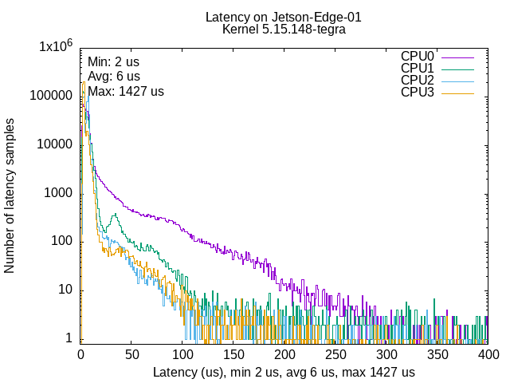
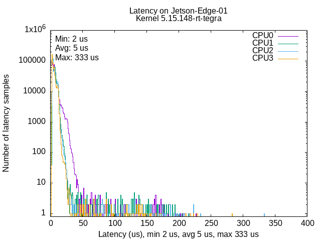
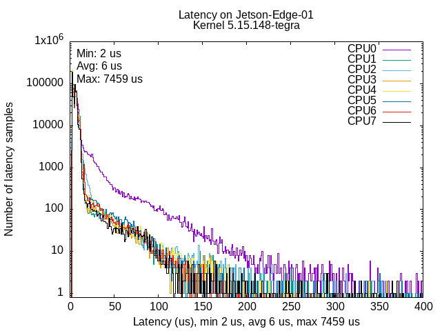
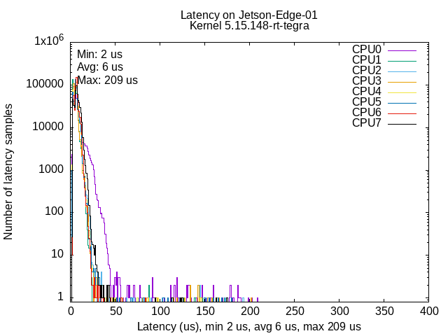

# Jetson-RT-Kernel

This repo includes a compiled **real-time** kernel for [Nvidia Jetson AGX Orin (Developer-Kit)](https://developer.nvidia.com/embedded/learn/jetson-agx-orin-devkit-user-guide/index.html) and a script for installation. The system version information is below:

* *JetPack Version - 6.2*
* *NVIDIA Jetson Linux - 36.4.3*
* *Linux kernel Version - 5.15.148*

**Real-Time Kerenel Patch**:

> **Preliminary:** The real-time (RT) kernel enables in-response CPU scheduling, resulting in improved system responsiveness for real-time applications. We strongly recommend that users apply the RT kernel patch for their system’s real-time performance.


> **Warning:** Nvidia has provided the rt-kernel with a Debian package management-based [OTA](https://docs.nvidia.com/jetson/archives/r36.4.3/DeveloperGuide/SD/Kernel/KernelCustomization.html#real-time-kernel-using-ota-update). But since it has been reported to cause the system to [freeze at boot](https://forums.developer.nvidia.com/t/boot-freezing-when-installing-preemptrt-on-nvme-setup-with-agx-orin-dev-kit-jetpack-6-2/323869) when entering the GUI, we recommend building and installing the kernel manually.

## Kernel Compile

> **Recommendation:** It is highly recommended to have a rough review for Nvidia's officia [documents](https://docs.nvidia.com/jetson/archives/r36.4/DeveloperGuide/index.html) if you are new to Jetson. 

Nvidia has provided a detailed [guidance](https://docs.nvidia.com/jetson/archives/r36.4.3/DeveloperGuide/SD/Kernel/KernelCustomization.html#sd-kernel-kernelcustomization) on building a customized kernel for Jetson platforms. Following this procedure typically produces:

   * A bindary real-time kernel image
   * The kernel module 5.15.148-rt-tegra
   * A set of DTB (Device Tree Blob) files for boot configuration

> **Note:** This repo contains the compiled real-time kernel and related dependencies. If you want to apply it, make sure your Jetson L4T is the same version as required. 

(Optional) If UEFI Secure Boot is not enabled, you can skip the kernel signing and encryption steps. Or otherwise, follow [Secure Boot](https://docs.nvidia.com/jetson/archives/r36.4.3/DeveloperGuide/SD/Security/SecureBoot.html#sd-security-secureboot).

## Installation

There're two options provided to install the compiled kernel:
   * Flash using `flash.sh`: Suitable for full image flashing. See [flashing support](https://docs.nvidia.com/jetson/archives/r36.4/DeveloperGuide/SD/FlashingSupport.html) for details.
   * Install the built kernel directly using the script `install_rt_kernel.sh`

For the second option, clone the repository on your Jetson device:

```bash
git clone git@github.com:Charlescai123/Jetson-RT-Kernel.git
```

For safety consideration, backup your current boot configuration:

```bash
sudo cp -rf /boot /boot_bak
```

Install the RT kernel by specifying the storage type (e.g., `nvme` or `emmc`):

```bash
cd Jetson-RT-Kernel
sudo ./install_rt_kernel.sh --storage <nvme|emmc>
```

Running this script will: 

   * Install DTBs to `/boot`
   * Decompress kernel modules to `/lib/modules`
   * Install the RT kernel image `Image.rt` to `/boot`
   * Install the RT initrd `initrd.img-5.15.148-rt-tegra` to `/boot`
   * Add a new boot entry to `/boot/extlinux/extlinux.conf`

Once complete, reboot and select the real-time kernel from the boot menu.

<!-- 
Here are some useful links for reference: 
- https://chipnbits.github.io/content/projects/RLUnicycle/rtkernel/rtpatch.html
- https://forums.developer.nvidia.com/t/preempt-rt-patches-for-jetson-nano/72941
- https://forums.developer.nvidia.com/t/jetson-agx-orin-rt-linux-without-reflashing/283832
- https://forums.developer.nvidia.com/t/no-display-with-preempt-rt-patches/240876
- https://forums.developer.nvidia.com/t/build-the-real-time-kernel/229571
- https://blog.csdn.net/weixin_43854380/article/details/126584835
- https://github.com/kozyilmaz/nvidia-jetson-rt/blob/master/docs/README.03-realtime.md -->


## Configuration and Test

### Verifying RT Kernel Installation

After rebooting, confirm that the RT kernel is loaded:

```bash
uname -vr
```

The expected output should be:

```bash
5.15.148-tegra #1 SMP PREEMPT RT
```


### Real time test using latency plot under the stress

Go to the `/test` file and Run the RT test

   ```
   cd test
   sudo ./rt-test.sh --cores <number-of-cores>
   ```

Dependencies (`rt-tests`, `stress`, `gnuplot`) will be installed automatically. If `<number-of-cores>` are not specified, the script  will default to the number of available CPU cores (`nproc`).

Below are example latency plots on the Jetson AGX Orin using 4 and 8 CPU cores:


| 4 Cores (non real-time kernel)                                        | 4 Cores (real-time kernel)                                        |
|-----------------------------------------------------------------------|-------------------------------------------------------------------|
|  |  |

| 8 Cores (non real-time kernel)                                        | 8 Cores (real-time kernel)                                        |
|-----------------------------------------------------------------------|-------------------------------------------------------------------|
|  |  |


Analysis:
- More sample on the left means lower latency in general
- More clustered samples indicate less flutter
- The max latency should not deviate far from mean value

## Acknowledgement
Thanks to [Ubuntu-RT-UP-Board](https://github.com/qiayuanl/Ubuntu-RT-UP-Board) for the real-time kernel testing script.
